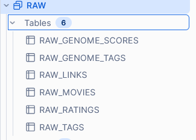
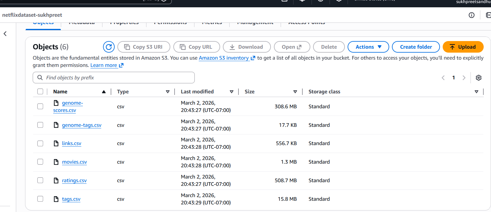
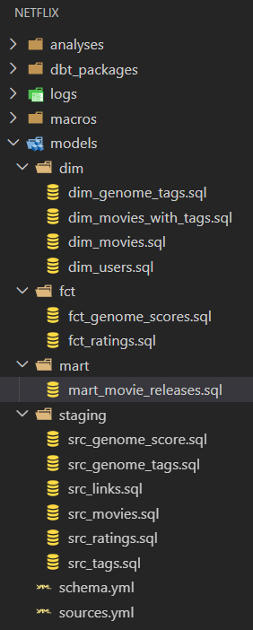
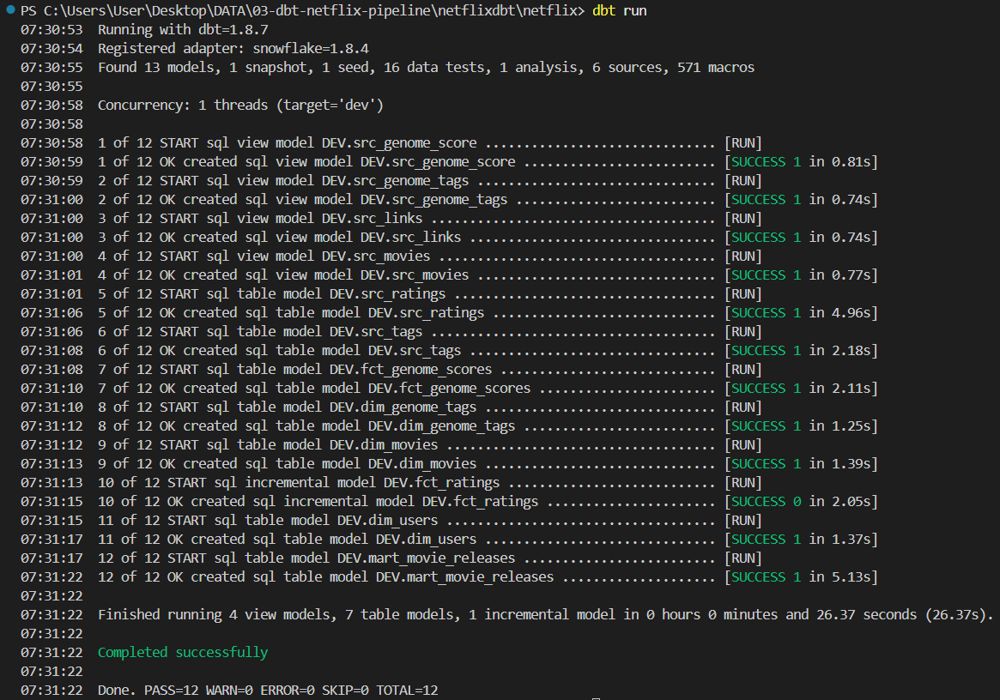
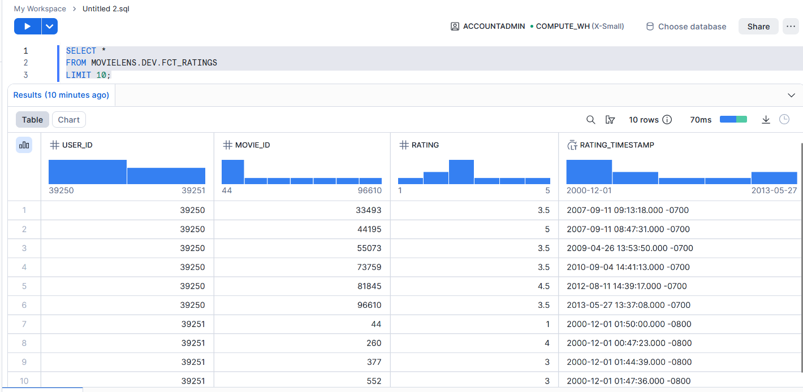

# Netflix Data Analytics Pipeline (Snowflake + dbt)

## Project Overview

This project demonstrates an end-to-end ELT data pipeline that simulates a Netflix-style analytics environment using the MovieLens dataset.

The pipeline ingests raw movie ratings data, loads it into a cloud data warehouse (Snowflake), and uses dbt (Data Build Tool) to transform the raw data into analytics-ready tables.

The goal of this project is to showcase modern Analytics Engineering and Data Engineering workflows, including cloud storage, data warehousing, and modular SQL transformations.

---

## Architecture

The data pipeline follows a modern ELT architecture.

MovieLens Dataset  
↓  
Amazon S3 (Raw Storage)  
↓  
Snowflake Data Warehouse  
↓  
dbt Transformations  
↓  
Analytics Tables (Dimensions & Facts)

---

## Technologies Used

- Amazon S3 - raw data storage  
- Snowflake - cloud data warehouse  
- dbt Core - SQL-based data transformation  
- SQL - data modeling and analysis  
- Git & GitHub - version control  

---

## Dataset

This project uses the MovieLens 20M Dataset, a publicly available dataset widely used for recommendation and analytics research.

The dataset contains:

- ~20 million movie ratings  
- ~138,000 users  
- ~20,000 movies  
- user tags and metadata  

Files used in the project:

- movies.csv  
- ratings.csv  
- tags.csv  
- genome-scores.csv  
- genome-tags.csv  
- links.csv  

---

## Data Pipeline Steps

### Data Ingestion

The raw dataset files were uploaded to Amazon S3, which serves as the raw data storage layer.

### Data Warehouse Setup

A Snowflake environment was configured with:

- compute warehouse  
- database  
- schema  
- roles and permissions  
- dbt service user  

### Raw Data Loading

Raw tables were created in the RAW schema and populated using Snowflake's COPY INTO command from the S3 stage.

Example:    COPY INTO RAW_MOVIES
            FROM @NETFLIXSTAGE/movies.csv
            FILE_FORMAT = (
            TYPE = 'CSV'
            SKIP_HEADER = 1
            );

### Data Transformation (dbt)

dbt was used to transform raw tables into structured analytics models.

Key transformation layers include:

Staging Models
- clean raw data
- standardize column names
- prepare source tables

Mart Models
- build dimension tables
- build fact tables
- prepare analytics-ready datasets

---

## Repository Structure

netflix-dbt-analytics-pipeline  
│  
├── dbt_project  
│   └── models  
│       ├── staging  
│       └── marts  
│  
├── screenshots  
│  
├── sql  
│   ├── setup_snowflake.sql  
│   ├── create_tables.sql  
│   └── load_data_snowflake.sql  
│  
├── .gitignore  
└── README.md  

---

## SQL Files

### setup_snowflake.sql

Configures the Snowflake environment:

- creates roles  
- creates warehouse  
- creates dbt user  
- sets up database and schema  
- grants permissions  

### create_tables.sql

Creates the raw tables used to store the MovieLens dataset.

Tables created:

- RAW_MOVIES  
- RAW_RATINGS  
- RAW_TAGS  
- RAW_GENOME_SCORES  
- RAW_GENOME_TAGS  
- RAW_LINKS  

### load_data_snowflake.sql

Creates the Snowflake stage connected to S3 and loads the dataset using COPY INTO.

---

## dbt Models

The dbt project contains two layers.

### Staging Layer

Transforms raw tables into cleaned source tables.

Examples:

- src_movies  
- src_ratings  
- src_tags  

### Mart Layer

Builds analytics-ready fact and dimension tables.

Examples:

- dim_movies  
- fct_ratings  

These tables can be used for analytics and BI reporting.

---

## Key Skills Demonstrated

This project demonstrates practical experience with:

- Cloud Data Warehousing  
- Snowflake Environment Setup  
- ELT Pipeline Design  
- dbt Analytics Engineering  
- SQL Data Modeling  
- Data Transformation Workflows  
- Data Pipeline Architecture  
- Version Control with Git  

---

## Future Improvements

Possible next steps for this project include:

- adding dbt tests and documentation  
- implementing incremental models  
- building a BI dashboard (Power BI or Tableau)  
- orchestrating pipelines with Airflow  
- extending analytics for recommendation insights  

---

## Pipeline Screenshots

### Snowflake Raw Tables

### S3 Dataset Files

### dbt Project Structure

### dbt Run Execution

### Analytics Query Result

## Author

Sukhpreet Sandhu  
BSc Computer Science:  University of Calgary
